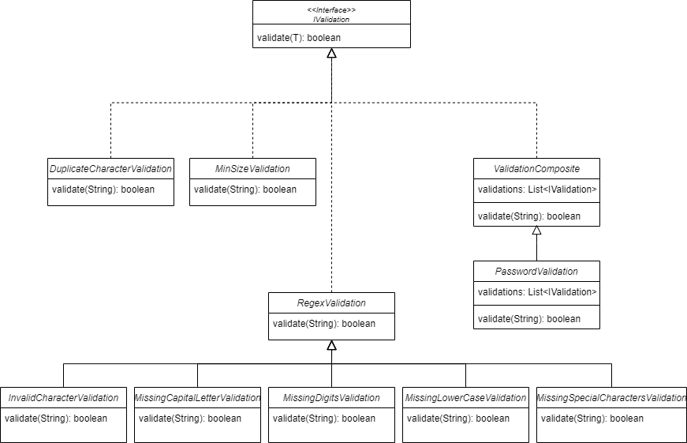

# Documentação

## Arquitetura da Solução

Para a solução foi pensado inicialmente em separação dos tipos de validações nescessárias para a senha. Com isso foi criado as validações para os seguintes cenários, de forma independente, permitindo assim a testabilidade unitária deles:

- Caracteres duplicados
- Caracteres inválidos
- Tamanho mínimo
- Obrigatoriedade de 1 digito
- Obrigatoriedade de 1 caracter especial
- Obrigatoriedade de 1 letra maiúscula
- Obrigatoriedade de 1 letra minúscula

Com a separação dos cenários, foi então pensado na forma de arquitetura e design do projeto, de como iriam ficar essas validações, e com isso foi adotado o design pattern [Composite](https://refactoring.guru/pt-br/design-patterns/composite), levando em consideração que uma validação senha é um composto de todas as validações apontadas anteriormente.

Com a adoção do composite nos da diversos beneficios, baixo aclopamento entre as validações e fácil extensibilidade, permitindo adicionar e remover novas validações facilmente e de forma abstrata.

Solução final do componente de validação na aplicação:

## Executando a aplicação

A execução se da de duas forma, via `gradle` ou via `docker`, onde em ambas a aplicação ficará exposta em http://localhost:8080

### Docker

- docker build -t password-validator-api .

- docker run -p 8080:8080 password-validator-api

### Gradle

- ./gradlew clean quarkusDev

  Obs: É nescessário a instalação do Java 17.

## Testando a Aplicação

A documentação da aplicação do endpoint está exposta no swagger, de forma a ser possivel a chamada do mesmo via swagger.

- Swagger: http://localhost:8080/q/swagger-ui

Testando o endpoint utilizando curl:

- `curl -X POST http://localhost:8080/password/validation --data "senha"`

### Rodando os testes

- ./gradlew clean test
